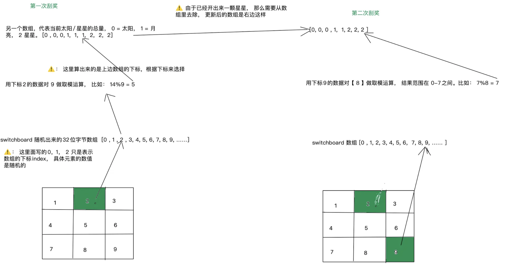

# Match3

一个基于Solana的九宫格刮刮卡游戏。

## 产品设计

1. 玩家在刮卡的时候需要有博弈， 在每次刮奖刮九宫格不同的格子的时候， 可能有不同的奖励。
2. 每刮一次奖， 下次刮奖的概率需要不一样。
3. 刮刮卡是NFT， 这样方便后期KOL合作。

## 技术选型

1. 使用anchor作为开发框架。
2. 使用 mpl_bubblegum 来mint cNFT。 这样可以大大减少mint NFT 的费用。
3. 使用 switchboard 来获取随机数。

## 程序设计

